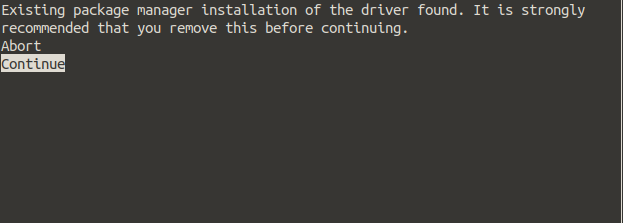
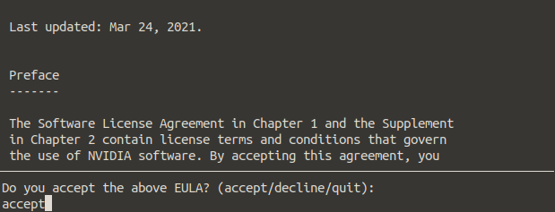
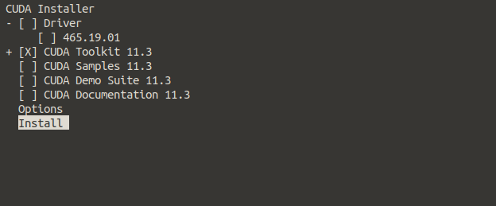

# 503-2 

## netstudio

### 3080TI

仅支持cuda11以上。

nvcc -V 查看版本

    nvcc: NVIDIA (R) Cuda compiler driver
    Copyright (c) 2005-2021 NVIDIA Corporation
    Built on Sun_Mar_21_19:15:46_PDT_2021
    Cuda compilation tools, release 11.3, V11.3.58
    Build cuda_11.3.r11.3/compiler.29745058_0

### anaconda安装

    sh Anaconda3-2022.05-Linux-x86_64.sh

不要使用sudo

### torch安装

https://pytorch.org/

建议安装1.8.2LTS版本

在anaconda中安装

新建一个自己的python版本环境

    conda create -n name python=3.8
    name:你的环境名字，自定义

激活自己新建的环境

    conda activate name
在自己的环境中安装torch

    conda install pytorch torchvision torchaudio cudatoolkit=11.1 -c pytorch-lts -c nvidia

已测试可用

### cuda_11.3.0_465.19.01_linux.run安装

    sudo sh cuda_11.3.0_465.19.01_linux.run

1、
    

2、

3、

4、环境变量

    vi .bashrc

    export PATH=/usr/local/cuda/bin${PATH:+:${PATH}}

    export LD_LIBRARY_PATH=/usr/local/cuda/lib64${LD_LIBRARY_PATH:+:${LD_LIBRARY_PATH}}

### cudnn安装

    tar -zxvf cudnn-11.3-linux-x64-v8.2.1.32.tgz

将`cuda/include/`和`cuda/lib64/`下文件分别放在`/usr/local/cuda/include/`和`/usr/local/cuda/lib64/`下
